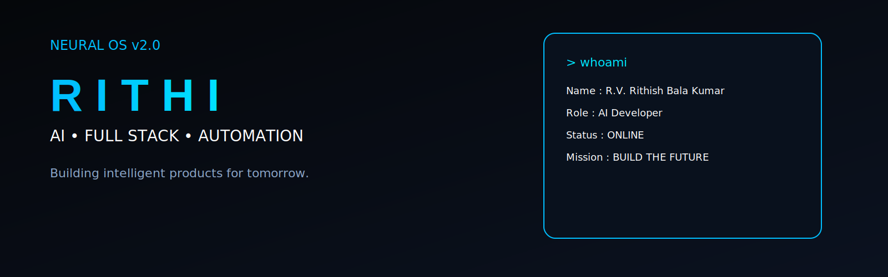

<div align="center">



<br><br>


</div>

<p>
Building intelligent products for tomorrow.
</p>


</div>

---

<div align="center">

# ⚡ NEURAL OS

</div>

```text
╔══════════════════════════════════════════════════════════════╗

            INITIALIZING NEURAL CORE...

            ████████████████████████ 100%

            USER      : R.V. RITHISH BALA KUMAR

            CODENAME  : RITHI

            ROLE      : AI & FULL STACK DEVELOPER

            LOCATION  : TAMIL NADU, INDIA

            STATUS    : ONLINE

            MISSION   : BUILD THE FUTURE

╚══════════════════════════════════════════════════════════════╝
```

---

# 👨‍💻 WHOAMI

```python
class Rithi:

    def __init__(self):

        self.name = "R.V. Rithish Bala Kumar"

        self.role = "AI & Full Stack Developer"

        self.education = "B.Tech AI & DS"

        self.location = "Tamil Nadu"

        self.current_focus = [

            "Artificial Intelligence",

            "Automation",

            "React",

            "Next.js",

            "FastAPI",

            "Building Premium Products"

        ]

    def life(self):

        while True:

            Learn()

            Build()

            Improve()

            Repeat()
```

---

# 🚀 TECH STACK

<p align="center">


</p>

---

# 📊 SYSTEM STATUS

| Module | Status |
|---------|--------|
| 🤖 Artificial Intelligence | ████████████ 95% |
| 💻 Full Stack Development | ██████████░ 90% |
| ⚡ Automation | █████████░░ 85% |
| 🎨 UI / UX | ███████████ 95% |
| ☁ Cloud | ███████░░░ 70% |

---
# 🚀 FEATURED PROJECTS

<div align="center">

<table>
<tr>

<td width="50%">

## 🍽 Restaurant Experience

Premium restaurant website built with modern UI.

**Stack**

`Next.js`

`React`

`Tailwind CSS`

`Responsive`

**Status**

🟢 Production

</td>

<td width="50%">

## 🤖 AI Automation

AI workflows & intelligent automation.

**Stack**

`Python`

`FastAPI`

`OpenClaw`

`n8n`

**Status**

🟢 Active

</td>

</tr>

<tr>

<td width="50%">

## 🌐 Portfolio

A futuristic developer portfolio.

**Stack**

`React`

`Next.js`

`GSAP`

`Tailwind`

**Status**

🟡 Building

</td>

<td width="50%">

## 🧠 TruthLens

AI-powered fake news detection.

**Stack**

`Python`

`Machine Learning`

`FastAPI`

`NLP`

**Status**

🟡 Development

</td>

</tr>
</table>

</div>

---

# 📈 GITHUB ANALYTICS

<div align="center">


</div>

<div align="center">


</div>

---

# ⚡ CURRENT OBJECTIVES

```text
◉ MASTER FULL STACK DEVELOPMENT

◉ BUILD AI PRODUCTS

◉ LEARN DATA ENGINEERING

◉ CONTRIBUTE TO OPEN SOURCE

◉ CREATE PREMIUM DIGITAL EXPERIENCES

◉ BUILD A SUCCESSFUL STARTUP
```

---

# 🛰 CONNECT

<div align="center">

<a href="https://github.com/rithishrbk-crypto">

</a>

<a href="https://linkedin.com">

</a>

<a href="https://yourportfolio.com">

</a>

</div>

---

<div align="center">

```text
while(alive){

    Learn();

    Build();

    Repeat();

}
```

⭐ Thanks for visiting my profile.

</div>
